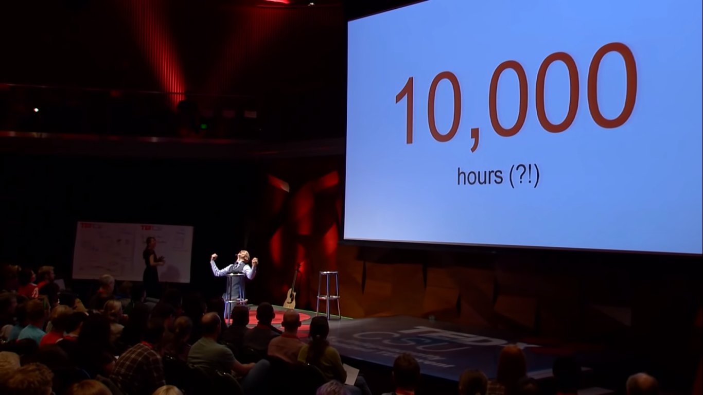
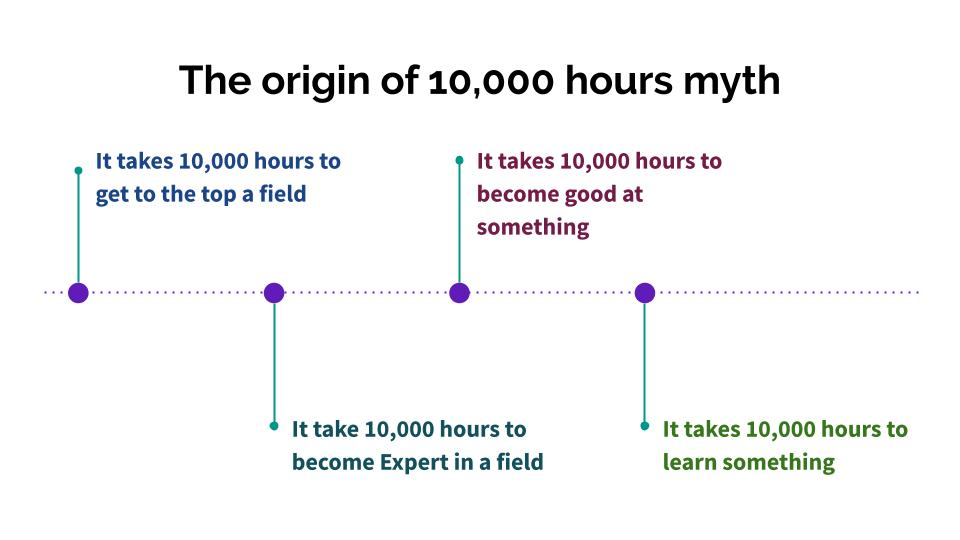
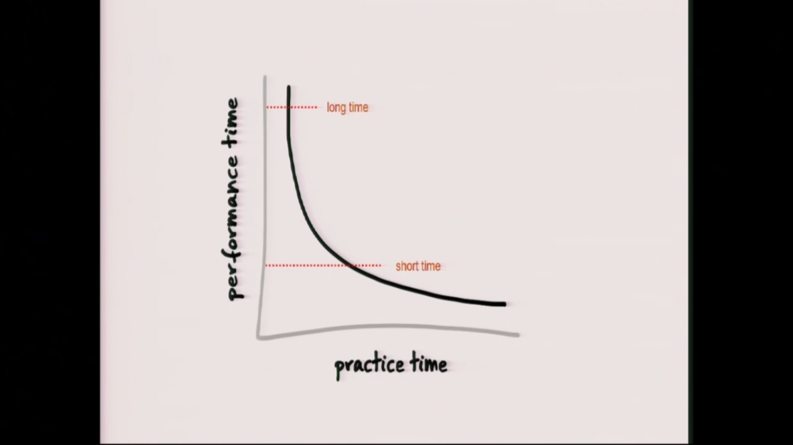
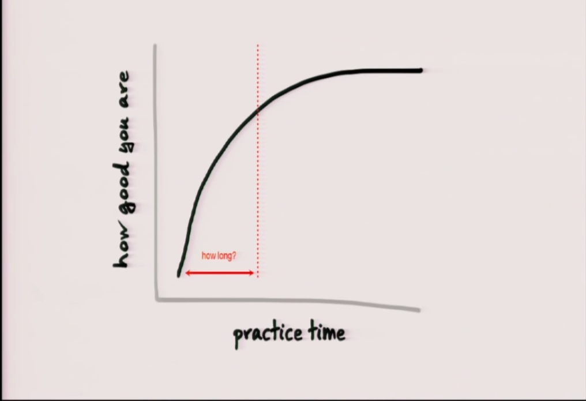
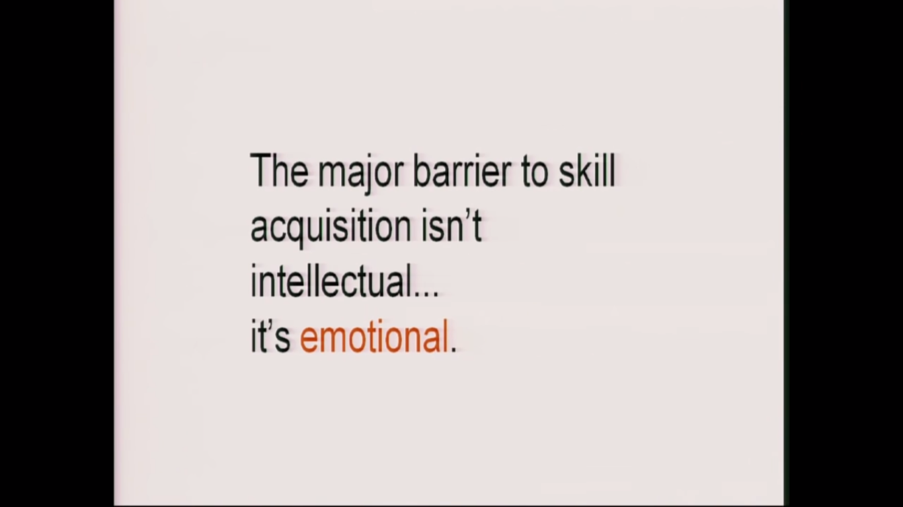

### 10,000 hours to learn somethin is a "Myth"

The idea of needing 10,000 hours to learn a new skill originated from the works of Prof K.Anders Ericsson.He conducted experiments on Chess grandmasters, professional atheletes,world class musician and other ultra high competetive people and came up with the 10,000 hours rule.He claimed that inorder to achieve the aforementioned level at a skill one needs to practice his skill for 10,000 hours.More time one spends on the skill the better one gets.

His work was picked up by an author Malcom Gladwell, who in his book-**"Outliers:The Story of Sucess"**,wrote about the 10,000 hour rule and importance of practice.This book was a bestseller and people started talking about this rule.And the message deviated more and more and more untill it became "**you need 10,000 hours to learn something"**.But it is not true.

## Research showing time required to learn a new skill

Research says that at the early stages it takes a long time to do a task, and the early part of practice is ver very efficient. People get good at things with just a little bit of practise.

The learning curve says that when one starts they are grossly incompetent. But with a little bit of practise the get really good,really quick.The early level of improvement is really fast.And the subsequent gains become much harder.

The period of going from **grossly incompetent** to **reasonably good** is _20 hours_. It takes only 20 hours of focused deliberate practise into the thing.

## Ways to learn in 20 hours

In order of practise one need to follow these **4 simple steps to rapid skill acquisition**. There's a way to practise efficiently.
	. Deconstruct the skill:- One needs to know exactly what is the goal and begin from the exact set of skills necessary.
	. Learn enough to self correct:-Instead of getting many resources and procrasting the prectice.One needs to learn just enough to actually practise and **self correct**.
	. Remove practise barriers:-Remove all the distractions, television,internet,games,etc and actually sit down and do the work.
	. Practise atleast 20 hours:- Get past the initial _frustration barrier_ ,the frustration of not knowing and feeling like a stupid. Actually sit down and practise for atleat 20 hours.The major barrier to learning is the fear of felling stupid.

