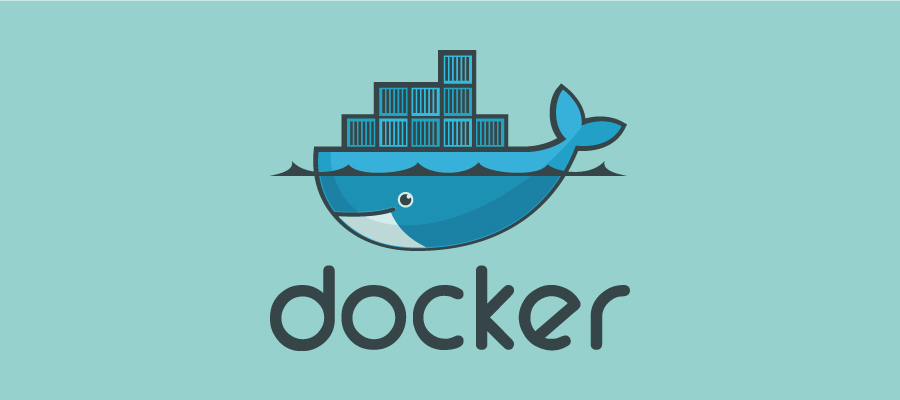
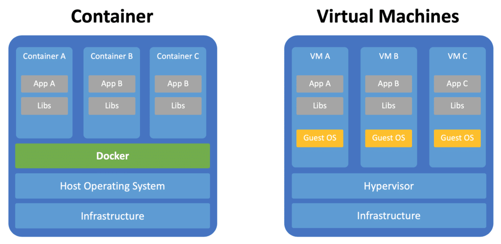
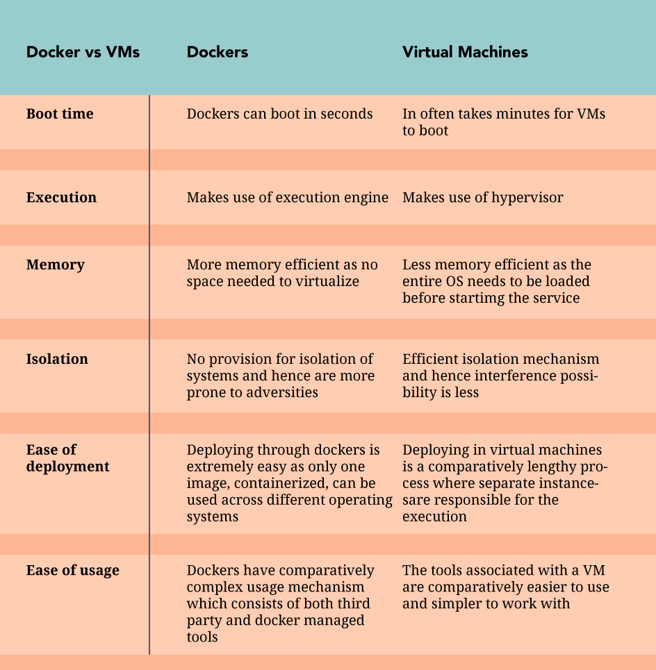
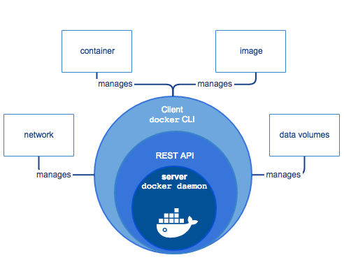

### What is Docker and how is it different from a virtual machine?

 Docker is a tool that allows developers, sys-admins etc. to easily deploy their applications in containers to run on the host operating system. 



 Docker allows user to package an application with all its dependencies into a standardized unit for software development.
 Something similar happens with virtual machines but conatiners do not have high overhead and hence are more efficient.
 VM's run applications inside a guest Operating System, which runs on virtual hardware powered by the server’s host OS.
While containers do not contain an operating system.



### How does docker work?


A **docker image** contains everything needed to run an application as a container like

	* code  
	* runtime  
	* libraries  
	* environment variables  
	* config files  



Image is created using a **docker file**.
A **Container** is a runtime instance of an image. Multiple containers can be created from an image.

Docker Engine which is the core component of Docker which is responsible for the overall functioning of docker. It is a client-server based application and consists of 3 main components.

	. A **Server** responsible for creating and managing Docker Images, Containers, Networks and Volumes on the Docker platform.  
	. **REST API** which specifies the way to interact with the server. It stands for **“Representational State Transfer”**. It is a set of rules that developers follow when they create their API.  
	. **Client** which is a **CLI** to allow users to interact with Docker.  

## How to create a Docker?
1. Installing Docker
	```
	$ sudo apt-get update
	$ sudo apt-get install \
	    apt-transport-https \
	    ca-certificates \
	    curl \
	    gnupg-agent \
	    software-properties-common
	$ curl -fsSL https://download.docker.com/linux/ubuntu/gpg | sudo apt-key add -
	$ sudo apt-key fingerprint 0EBFCD88
	$ sudo add-apt-repository \
	   "deb [arch=amd64] https://download.docker.com/linux/ubuntu \
	   $(lsb_release -cs) \
	   stable nightly test"
	$ sudo apt-get update
	$ sudo apt-get install docker-ce docker-ce-cli containerd.io  
	// Check if docker is successfully installed in your system
	$ sudo docker run hello-world
	``` 

2. Creating a container
	```
	docker create [options] IMAGE [commands] [arguments]
	```
Eg. to create  a container using fedora
```
$ docker create fedora
```

3. Starting a container
```
$ docker start [options] CONTAINER ID/NAME [CONTAINER ID/NAME…]
```
 Eg to create a container name Harsheet
```
$ docker start Harsheet
```

4. Stopping a container
```
$ docker stop [options] CONTAINER ID/NAME [CONTAINER ID/NAME…]
```

Eg to stop a container named Harsheet
```
$ docker stop Harsheet
```

## How to create an Application?


