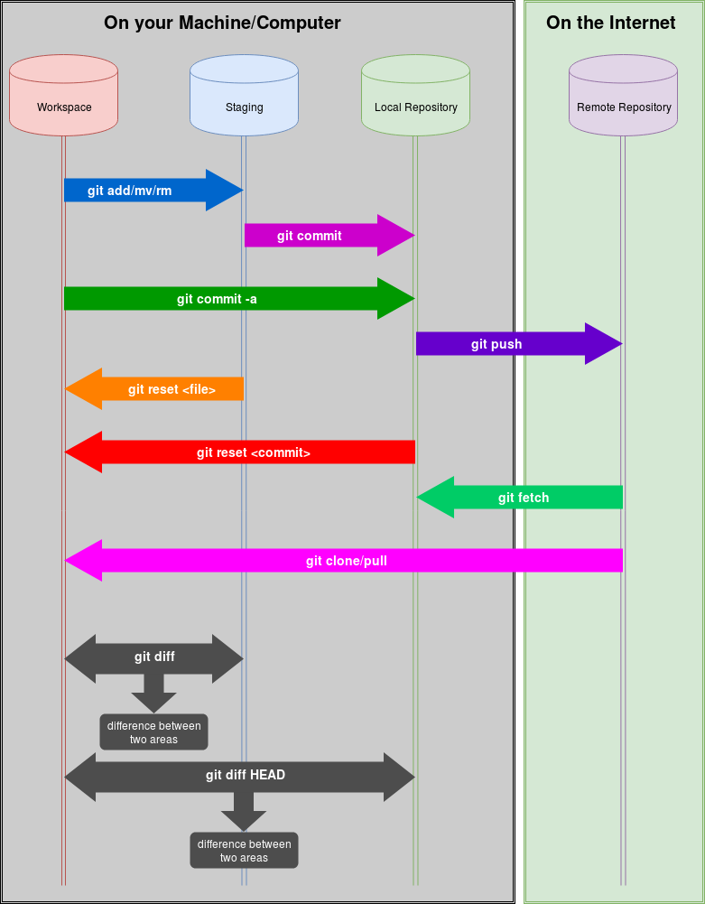
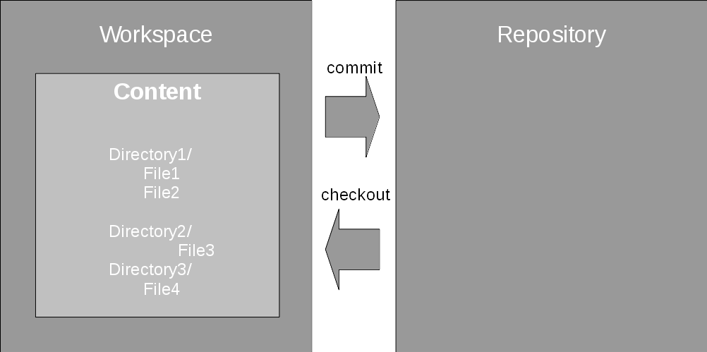
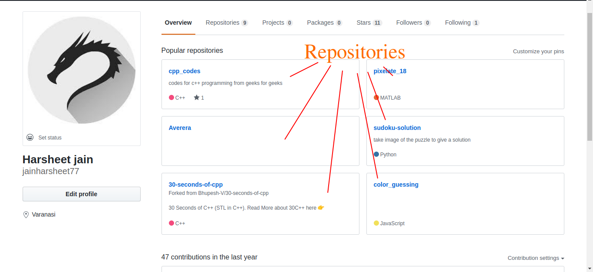
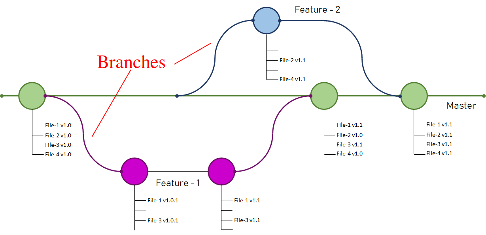

## What is GIT?
Git is a commonly used decentralized source code repository. It was created by the Linux creator _Linus Torvalds_ for the management of the Linux kernel source code. 


## GIT BASICS  
Git is a version-control software to ease collaboration with teammates.It also makes developing a software very easy by acting as a tool to manage different versions and features of the project.

The repository holds all versions of the content of the software, while the working directory, which is on your local machine, is the place where you modify the code. You checkout code from the repository to the working directory and commit changes you’ve made in this working directory back into a new version of the content in the repository.You can Push content from a working directory to remote repository.

Each commit creates a new child version of the content that derives from the previous, parent version that you modified.

First, Git handles content in snapshots, one for each commit, and knows how to apply or roll back the change sets between two snapshots.

To start working with Git, you just need to run the “git init” command. It turns the current directory into the Git working directory and creates the repository in the .git (hidden) directory it creates there. You can then start working with Git.

The **commit** command confirms the changes and makes the final changes from staging area to the repositories in working directory. With **add** command, a change in the working directory is added to the staging area for the next commit. This staging area is usually called the index.



### What is a Repository?  

Often called as a repo. A repository is the collection of files and folders also known as code files.


#### Creating a Repository:-  
To create a new repository, all you need to do is create a new project or fork an existing project.

### What is a Commit?  

It is like saving your code.When you commit a code,it gets transferred from your local machine to a remote repository.

### What is Forking?
If you fork a repo you get an entirely new repo of that code under your own name.
to Fork a Repo

### What is Cloning?
Cloning takes the entire online repository and makes an exact copy of it on your local machine.
```sh
$ git clone <link-to-repository>
```

### What is Push?

Pushing is syncing your commits to remote storage.

### What is a Branch?

Think of it as branches of a tree.The trunk of the tree is the main software called **Master branch** . The branches are the seperate instances of the main codebase. It is like a personal copy created from the main codebase.

The concept behind branching is that each snapshot can have more than one child. Applying a second change set to the same snapshot creates a new, separate stream of development. And if it is named, it is called a branch.  
#### To make a new branch
```sh
$ git checkout master
$ git checkout -b <your-branch-name>
```



