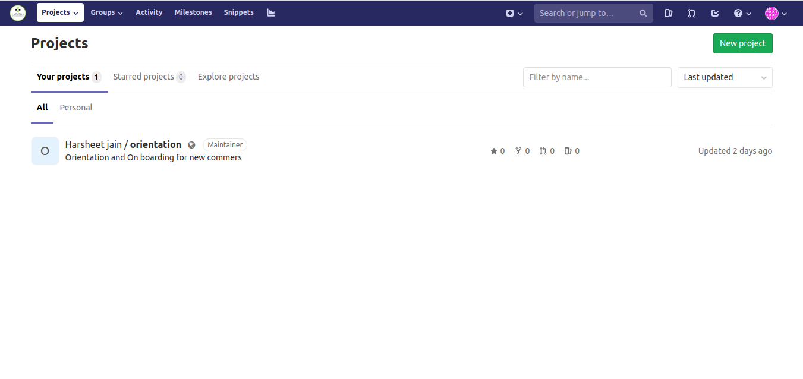

## GIT BASICS  
Git is a version-control software to ease collaboration with teammates.It also makes developing a software very easy by acting as a tool to manage different versions and features of the project. 

  
### What is a Repository?  

Often called as a repo. A repository is the collection of files and folders also known as code files.

### What is a Commit?  

It is like saving your code.When you commit a code,it gets transferred from your local machine to a remote repository.

### What is Push?

Pushing is syncing your commits to remote storage.

### What is a Branch?

