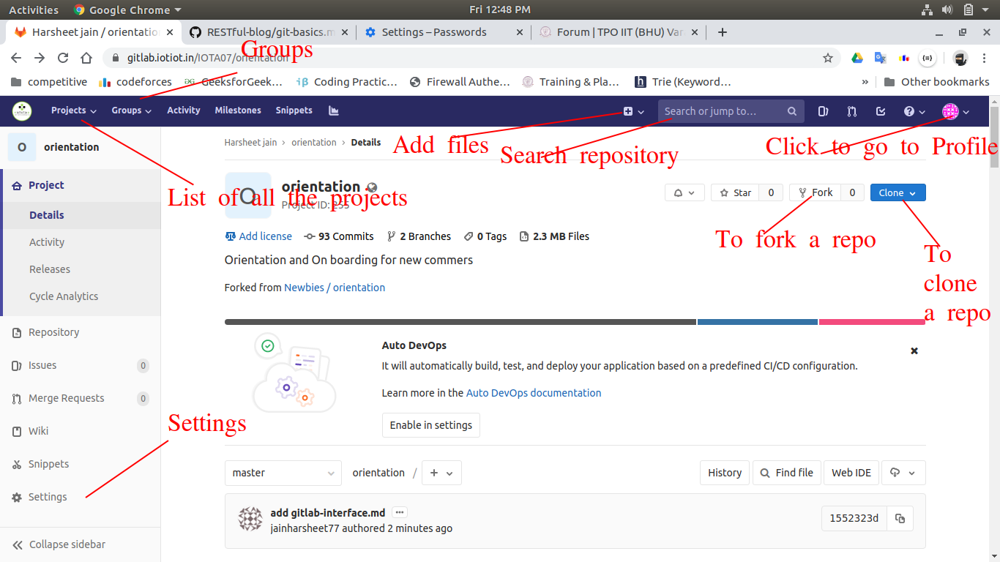
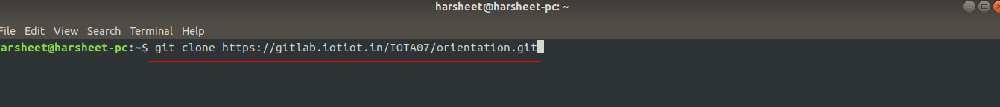

### Introduction

GitLab is a great way to manage git repositories on a centralized server.It is the second most popular manager for repositories.GitLab gives you complete control over your repositories and allows you to decide whether they are public or private for free.

Gitlab is an open source service that provides remote access to Git repositories. In addition to hosting your code, the services provide additional features designed to help manage the software development lifecycle.



### Creating a project

To create a project in GitLab:

1. In your dashboard, click the green New project button or use the plus icon in the navigation bar. This opens the New project page.
2. On the New project page, choose if you want to:
	. Create a blank project.
	. Create a project using with one of the available project  templates.
	. Import a project from a different repository, if enabled on your GitLab instance. Contact your GitLab admin if this is unavailable.
	. Run CI/CD pipelines for external repositories.


### Adding files

To Add a file we can use the GUI or the terminal.
Using GUI we can Create files or upload files by clicking or draging and dropping.


By Terminal

)images/gitlab/adding_files.png)

### Link to clone
1. Copy the link from the window. 


2. Write the command in a terminal window of the desired directory.
	```
	git clone <clone link of the repository>
	```
	


### List of Projects


### List of File


### List of All contributors


### To see Commits


### Inside a file


### Inside a Repo


