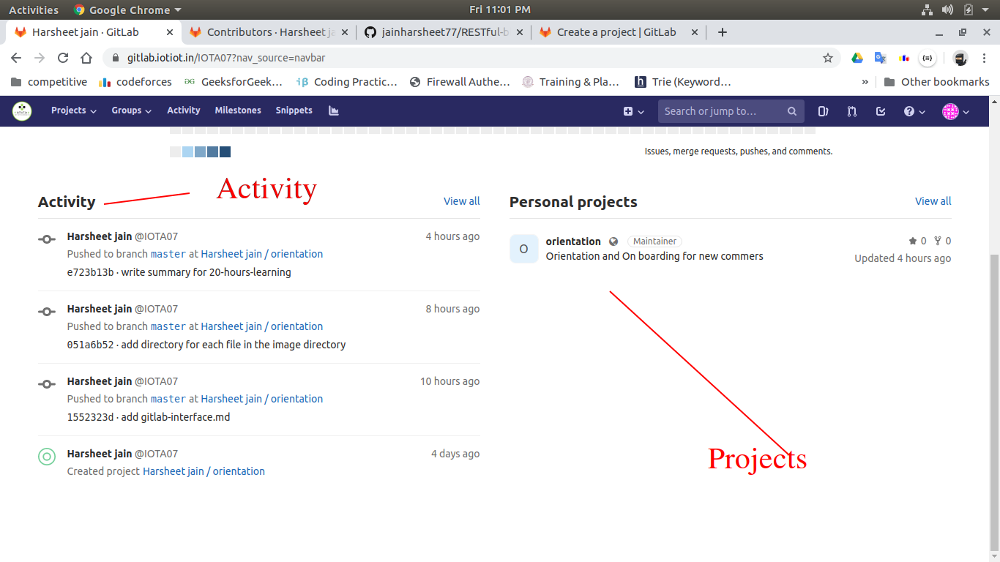
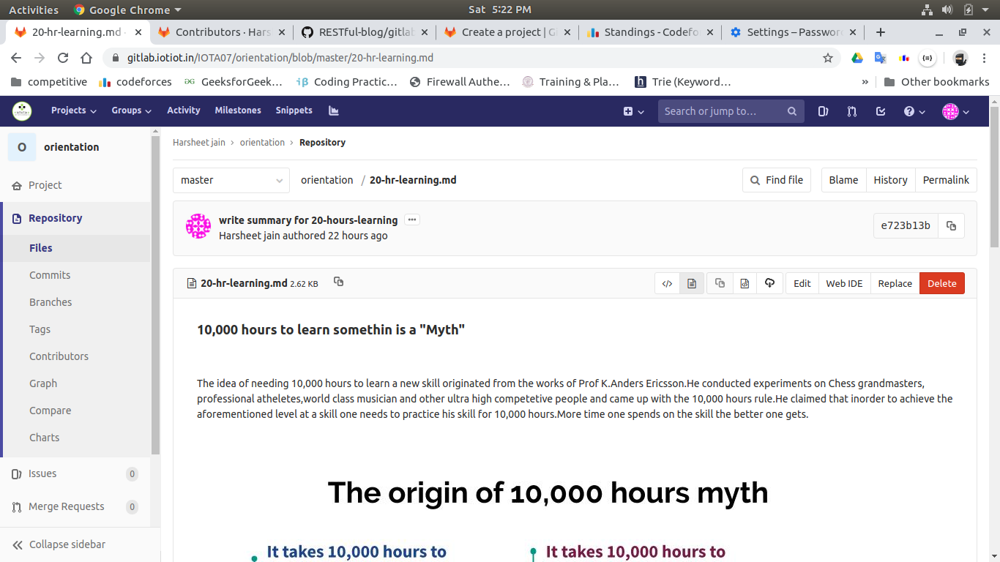

### Introduction

GitLab is a great way to manage git repositories on a centralized server.It is the second most popular manager for repositories.GitLab gives you complete control over your repositories and allows you to decide whether they are public or private for free.

Gitlab is an open source service that provides remote access to Git repositories. In addition to hosting your code, the services provide additional features designed to help manage the software development lifecycle.

### Creating a project

### Adding files

### Link to clone

### List of Repo

### List of File

### List of All contributors

### To see Commits

### Inside a file

### Inside a Repo

